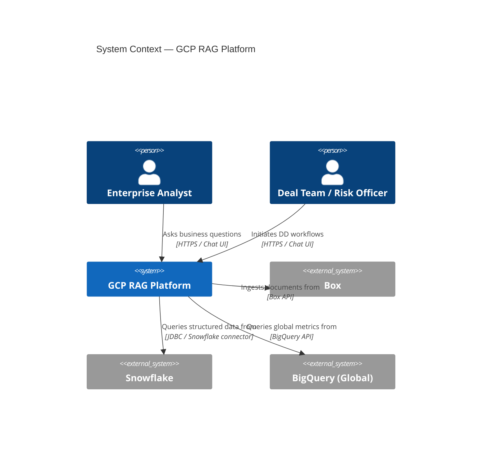
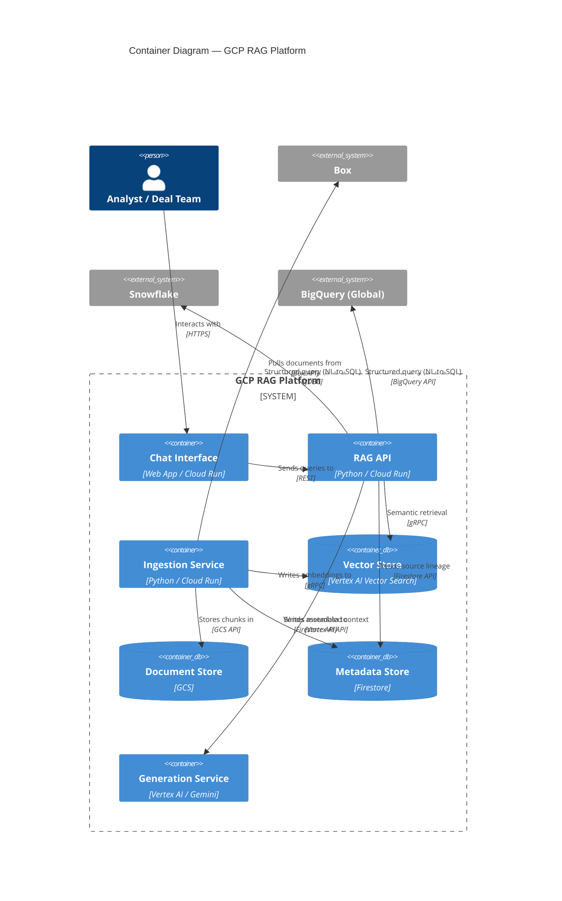
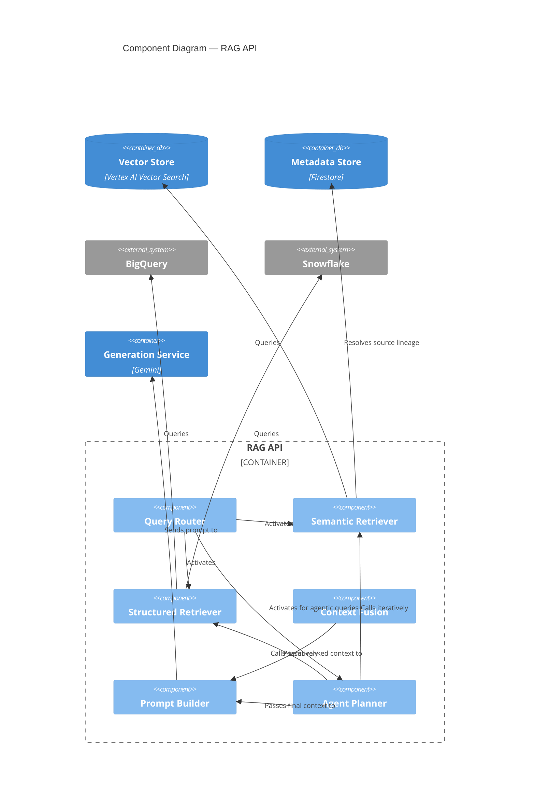
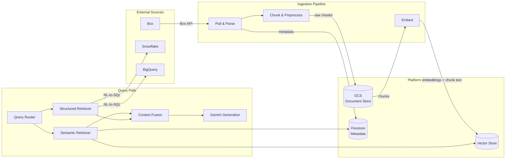

# Architecture

## C4 Model

### L1 — System Context

#### Components

| Element | Type | Description |
|---|---|---|
| Enterprise Analyst | User | Regional finance analyst querying across business metrics and internal documents |
| Deal Team / Risk Officer | User | Initiates multi-step due diligence workflows requiring cross-source synthesis |
| GCP RAG Platform | System | The platform under design — routes NL queries to the appropriate retrieval paths and returns grounded, cited answers |
| Box | External System | Enterprise document repository holding internal reports, strategy documents, and guidance |
| Snowflake | External System | Regional operational data store — P&L, product-level metrics, regional KPIs |
| BigQuery (Global) | External System | Global data warehouse owned by HQ — enterprise-wide metrics and reference data |

---

### L2 — Containers

> **Note:** The direct connections from the RAG API to Snowflake and BigQuery reflect the internal Structured Retriever component's responsibility, not a direct dependency of the API container itself. See L3 for the accurate component-level view.

#### Containers

| Container | Technology | Description |
|---|---|---|
| Chat Interface | Web App / Cloud Run | User-facing interface for natural-language query entry and response display. Stateless; delegates all logic to the RAG API. |
| RAG API | Python / Cloud Run | Central orchestrator. Receives queries, activates the appropriate retrieval paths, assembles context, and drives generation. |
| Ingestion Service | Python / Cloud Run | Offline pipeline that pulls documents from Box, chunks and preprocesses them, generates embeddings, and writes to platform storage. Runs on schedule or event trigger. |
| Vector Store | Vertex AI Vector Search | Stores dense vector embeddings of document chunks. Queried by the Semantic Retriever for nearest-neighbour search. |
| Document Store | GCS | Persistent storage for raw and chunked documents post-ingestion. Source of truth for document content. |
| Metadata Store | Firestore | Stores document metadata, ingestion state, and chunk-to-source lineage records used for citation resolution. |
| Generation Service | Vertex AI / Gemini | Receives an assembled prompt with retrieved context and produces the final grounded answer. |

---

### L3 — RAG API (Component)

#### Components

| Component | Description |
|---|---|
| Query Router | Classifies the incoming query and determines which retrieval paths to activate — semantic, structured, or both. For agentic queries (UC-02), hands off to the Agent Planner. |
| Semantic Retriever | Performs nearest-neighbour search against the Vector Store to find relevant document chunks. Resolves chunk-to-source lineage via the Metadata Store for citation. |
| Structured Retriever | Translates the natural-language query into SQL and executes it against BigQuery or Snowflake. Owns all connections to structured external sources. |
| Context Fusion | Merges results from all active retrieval paths, de-duplicates, and re-ranks by relevance before passing to the Prompt Builder. |
| Prompt Builder | Assembles the final prompt: system instructions, retrieved context with citations, and the original query. Controls context window budget. |
| Agent Planner | Implements the agentic loop for multi-step workflows (UC-02). Plans a sequence of retrieval and reasoning steps, executes them iteratively, and hands the final assembled context to the Prompt Builder. |

---

## Data Architecture

### Data Sources & Ownership

| Source | Type | Owner | Content | Access Pattern |
|---|---|---|---|---|
| Box | Unstructured | Business / local entity | Internal reports, strategy docs, risk assessments, guidance | Pull via Box API on schedule or event |
| Snowflake | Structured | Regional finance / ops | P&L, product-level metrics, regional KPIs | NL-to-SQL query at runtime |
| BigQuery (Global) | Structured | Global HQ / data platform | Enterprise-wide metrics, KPIs, reference data | NL-to-SQL query at runtime |
| GCS (Document Store) | Unstructured | RAG Platform | Chunked and raw documents post-ingestion | Internal — read by retrieval layer |
| Vertex AI Vector Search | Vector | RAG Platform | Embeddings of document chunks | Internal — semantic retrieval |
| Firestore | Semi-structured | RAG Platform | Document metadata, chunk-to-source lineage, ingestion state | Internal — lineage and citation resolution |

---

### Data Flow

---

### Data Governance Principles

- **Lineage** — every answer chunk is traceable to a source document or query via Firestore metadata
- **No data duplication at rest** — structured sources (Snowflake, BigQuery) are queried live; only documents are ingested and stored
- **Access control** — service accounts follow least-privilege; Box and Snowflake credentials are stored in Secret Manager
- **Data residency** — all GCP-managed storage (GCS, Firestore, Vector Search) is provisioned in a single agreed region
- **Retention** — ingested document chunks inherit the retention policy of the source; metadata is retained for the lifetime of the POC
