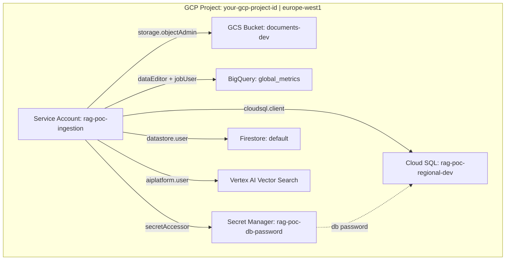

# Infrastructure

## Overview

All GCP infrastructure is managed via Terraform, with local state. Resources are provisioned in a single GCP project under a single region.

| Property | Value |
|---|---|
| GCP Project | `your-gcp-project-id` |
| Region | `europe-west1` |
| Terraform state | Local (`terraform/terraform.tfstate`) |
| IaC location | `terraform/` |

---

## Diagram



---

## Provisioned Resources

### GCS Bucket — Document Store

| Property | Value |
|---|---|
| Name | `your-gcs-bucket-name` |
| Location | `europe-west1` |
| Access | Uniform bucket-level access |
| Folder structure | `raw/` — seed and ingested documents |

Substitutes for Box in the POC. The ingestion pipeline reads from `raw/` and writes processed chunks back here.

---

### BigQuery — Global Metrics

| Property | Value |
|---|---|
| Dataset | `global_metrics` |
| Table | `global_metrics` |
| Location | `europe-west1` |

Holds enterprise-wide KPI and product line performance data. Queried at runtime by the Structured Retriever via NL-to-SQL.

---

### Cloud SQL — Regional Metrics

| Property | Value |
|---|---|
| Instance name | `rag-poc-regional-dev` |
| Engine | PostgreSQL 16 |
| Tier | `db-f1-micro` (ENTERPRISE edition) |
| Region | `europe-west1` |
| Public IP | `your-cloud-sql-public-ip` |
| Database | `regional` |
| Schema | `regional` |
| Table | `regional_metrics` |
| Backups | Disabled (POC) |
| Disk | 10GB, no autoresize |

Substitutes for Snowflake in the POC. Queried at runtime by the Structured Retriever via NL-to-SQL.

> **Cost note:** Cloud SQL `db-f1-micro` runs always-on (~$7/month). Destroy the instance when not actively developing to avoid unnecessary spend: `terraform destroy -target=google_sql_database_instance.regional`.

---

### Firestore — Metadata Store

| Property | Value |
|---|---|
| Database | `(default)` |
| Mode | Native |
| Location | `europe-west1` |

Stores document and chunk records for the ingestion pipeline. Two collections: `documents` (one record per ingested file, tracks ingestion status) and `chunks` (one record per chunk, links back to the source document for citation resolution at query time).

---

### Vertex AI Vector Search — Embedding Index

| Property | Value |
|---|---|
| Index name | `rag-poc-index-dev` |
| Dimensions | 768 (`text-embedding-004`) |
| Distance measure | `DOT_PRODUCT_DISTANCE` |
| Update method | `STREAM_UPDATE` |
| Endpoint | `rag-poc-index-endpoint-dev` |
| Deployed index ID | `rag_poc_index_v1` |

Stores dense vector embeddings of document chunks. Queried by the Semantic Retriever during the query path. The deployed index endpoint ID is exposed via `terraform output vector_search_endpoint_id`.

> **Cost note:** The Vector Search deployed index is an always-on resource. Destroy when not actively developing: `terraform destroy -target=google_vertex_ai_index_endpoint_deployed_index.rag_poc`. Note that re-deploying takes 30–60 minutes.

---

### Secret Manager

| Secret | Purpose |
|---|---|
| `rag-poc-db-password` | Cloud SQL `rag` user password |

---

### Service Account & IAM

| Property | Value |
|---|---|
| Service account | `rag-poc-ingestion@your-gcp-project-id.iam.gserviceaccount.com` |

| Role | Scope | Purpose |
|---|---|---|
| `roles/storage.objectAdmin` | Project | Read/write GCS bucket |
| `roles/bigquery.dataEditor` | Project | Read/write BigQuery tables |
| `roles/bigquery.jobUser` | Project | Execute BigQuery jobs |
| `roles/cloudsql.client` | Project | Connect to Cloud SQL via Auth Proxy |
| `roles/secretmanager.secretAccessor` | `rag-poc-db-password` | Read DB password from Secret Manager |
| `roles/datastore.user` | Project | Read/write Firestore metadata and chunk records |
| `roles/aiplatform.user` | Project | Upsert embeddings to and query Vector Search |

---

## Terraform

### Structure

```
terraform/
  main.tf                   # All resources
  variables.tf              # Input variables
  outputs.tf                # Outputs (IPs, names, etc.)
  terraform.tfvars          # Actual values (gitignored)
  terraform.tfvars.example  # Template (committed, gitignored when containing secrets)
  .terraform/               # Provider cache (gitignored)
  terraform.tfstate         # Local state (gitignored)
```

### Common Commands

```bash
cd terraform

# Preview changes
terraform plan

# Apply changes
terraform apply

# Destroy a specific resource (e.g. to pause Cloud SQL costs)
terraform destroy -target=google_sql_database_instance.regional

# Destroy everything
terraform destroy
```

> Always run `terraform plan` before `apply`. Never use `-auto-approve` unless you are certain of the changes.

---

## Local vs GCP Environment

| Component | Local | GCP |
|---|---|---|
| Document store | `fake-gcs-server` on port `4443` | GCS bucket `your-gcs-bucket-name` |
| Global metrics | `bigquery-emulator` on port `9050` | BigQuery `global_metrics.global_metrics` |
| Regional metrics | `postgres:16` on port `5432` | Cloud SQL `rag-poc-regional-dev` at `your-cloud-sql-public-ip` |
| Metadata store | Firestore emulator on port `8090` | Firestore `(default)` database |
| Vector store | `MockVectorStore` (no-op, in-process) | Vertex AI Vector Search `rag_poc_index_v1` |

When switching between local and GCP, remember to `unset BIGQUERY_EMULATOR_HOST` — see [data-sources.md](../research/data-sources.md).
