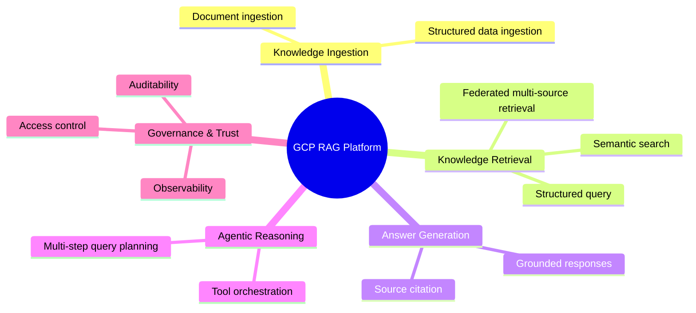

# Business Context

## Problem

Large financial services organisations hold business-critical knowledge across siloed, heterogeneous systems — structured data warehouses, document repositories, operational databases, and local entity stores. Analysts spend significant time manually aggregating information across these sources to answer questions that span both quantitative metrics and qualitative guidance.

Existing search and BI tools operate within a single source boundary. There is no unified, natural-language interface that can ground answers across structured and unstructured data simultaneously, at global and local organisational levels.

## Business Value

- **Faster insight** — reduce analyst time-to-answer from hours to seconds for cross-source queries
- **Grounded responses** — LLM answers are traceable to source documents and data, reducing hallucination risk in regulated contexts
- **Reusable architecture** — patterns validated in this POC can be adopted across business units and geographies
- **GCP AI stack evaluation** — provides a working baseline to assess Vertex AI, Gemini, and managed data services for enterprise AI readiness

---

## Use Cases

### UC-01 — Federated Knowledge Query

**Actor:** Enterprise analyst
**Trigger:** A question that cannot be answered from a single data source

**Scenario:**
A regional finance analyst asks a question that requires synthesising global reference data (BigQuery) with local entity data (Snowflake) and internal guidance documents (Box / GCS). The system routes the query to the appropriate retrieval paths, aggregates context, and returns a single grounded answer with citations.

**Example query:**
> *"What were the top 3 underperforming product lines in EMEA last quarter, and is there any internal remediation guidance applicable to this region?"*

**Data sources involved:**
- BigQuery — global business metrics and KPIs
- Snowflake — regional P&L and product-level data
- Box / GCS — internal strategy and remediation documents

**Value:** Eliminates manual cross-system lookups; answer is produced in one interaction with full source traceability.

---

### UC-02 — Agentic Due Diligence Assistant

**Actor:** Deal team analyst / risk officer
**Trigger:** A multi-step research task requiring reasoning across documents and structured data

**Scenario:**
An analyst initiates a due diligence task for a target entity. Rather than returning a single answer, the system autonomously plans and executes a sequence of retrieval and reasoning steps: fetching the relevant risk assessment report, cross-referencing it with current financial metrics, checking for regulatory flags, and surfacing a structured summary with confidence indicators and unresolved questions.

**Example query:**
> *"Run a preliminary due diligence summary for Project Apollo — include financial exposure, open risk items, and any regulatory considerations flagged in recent reports."*

**Agent steps (illustrative):**
1. Retrieve Project Apollo risk assessment from document store
2. Extract key risk line items and financial figures
3. Cross-reference with current budget and exposure data from BigQuery
4. Query regulatory document index for related compliance flags
5. Synthesise findings into a structured DD summary, flagging gaps and low-confidence items

**Value:** Compresses multi-hour manual research into a single agentic workflow; surfaces gaps and uncertainties explicitly rather than hiding them in a flat answer.

---

## Capability Map

